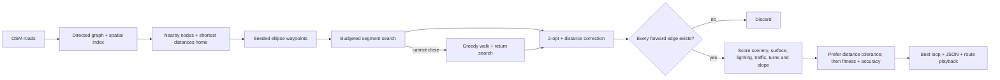

# How VeloGraph builds a cycling loop

The [interactive report](report/index.html) expands every stage with source links,
examples and evidence. A coordinate start now has a maximum snapping distance
(default 250 m). Area mode tries a bounded nearest-first set of eligible starts;
the selected node is both start and finish. Area candidates run sequentially, each
with the full per-start iteration budget and the same selection rule.

Given a start and target length, the hybrid engine tries several waypoint loops and
keeps the best valid candidate. Independent iterations run on worker threads.

The reverse graph is used **only to compute distances home**. Routing follows
forward edges. A drawn connection is never enough to establish connectivity.

`--engine hybrid` is the default; `--engine greedy` is a comparison baseline with
identical validation, refinement, seeds and scoring. The hybrid engine includes
the greedy fallback. Both are bounded heuristics, not exact shortest-path or
optimal-cycle solvers. A single weighted-cost label per node can miss a feasible
route under a separate distance constraint.

The distance tolerance is a selection preference: a candidate inside the requested
band beats one outside it. Within each group the score is
`0.6 * fitness + 0.4 * distance_accuracy`. If no candidate is in tolerance, a valid
best-effort loop can still be returned; JSON explicitly reports `within_tolerance`.
A failed search returns an empty route and exit code 2.

The map's playback shows traversal of the **final returned route**, not a trace of
internal search expansions. Graph simplification can also remove intermediate
geometry; the map connects the retained nodes.

## Remaining quality limitations

- Route quality depends on the input network, start, seed and iteration budget.
- The parser currently has incomplete bicycle access/one-way tag interpretation
  (including `oneway=-1`, roundabouts, and bicycle-specific exceptions). Forward-edge
  validation guarantees graph consistency, not full OSM restriction compliance.
- Traffic and scenery are proxies based on road classification, not measured traffic
  or landscape data. Existing profiles are heuristic scores, not safety guarantees.
- Tests and benchmark selection must include failure cases and unseen starts.

CPU/memory profiling is deferred in [issue #4](https://github.com/SpeziMM/VeloGraph/issues/4);
reliable infeasibility proofs are deferred in [issue #5](https://github.com/SpeziMM/VeloGraph/issues/5).
